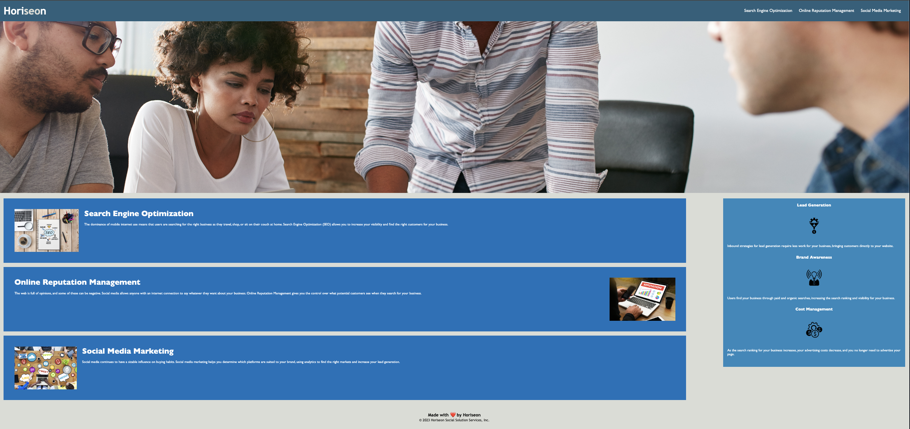

# Module 1 HTML CSS GIT 

I changed the title to be more descriptive, Utilized correct semantic HTML elements, Added alt attributes, Heading attributes are in sequential order.

# Screenshot of Webpage

# Edits I Made 

Changed Title to Horiseon Online Marketing  
Changed a "div" to "Header"  
Added a semantic element id="nav"  
Added a semantic element id="section"  
Added a semantic element id="aside"  
Added Title and Alt attributes to images  
Removed a closing "img"  
Changed a "div" to semantic element "footer"  
Fixed "Search Engine Optimization" redirect to that section of the webpage  
Consolidated and organized CSS  

# Link To Site

https://spencerklink.github.io/Horiseon-A-1/